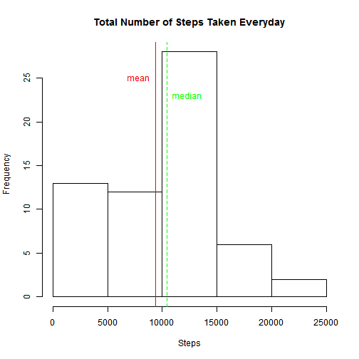
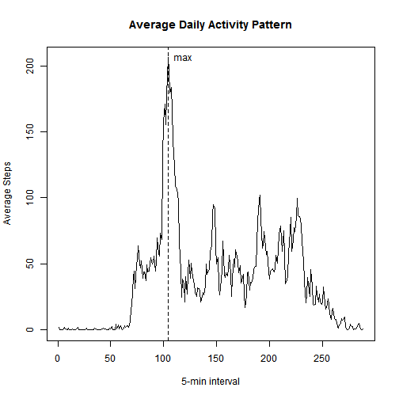
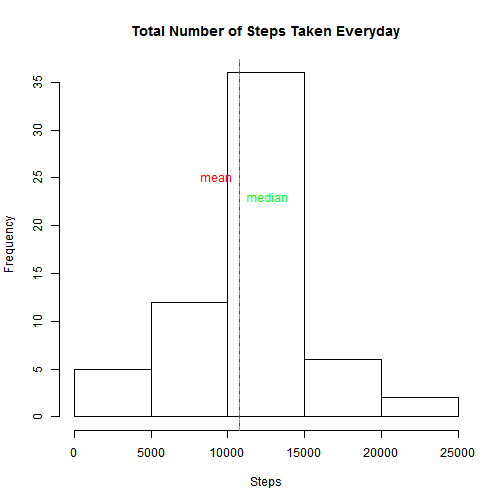
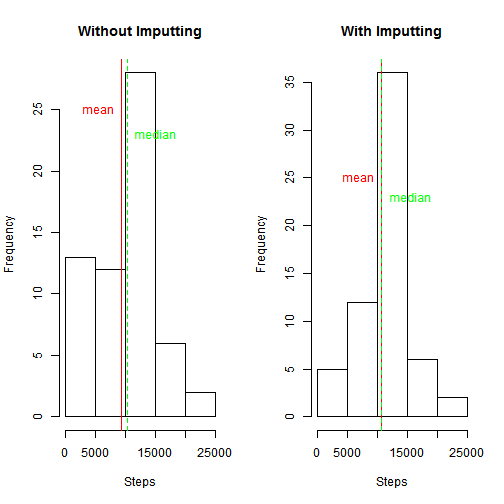
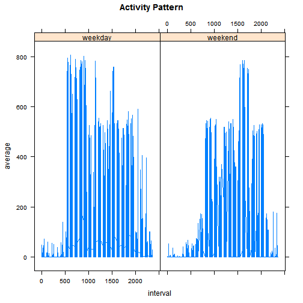

Loading and preprocessin the data


```r
library(plyr)
```

```
## 
## Attaching package: 'plyr'
## 
## The following object is masked from 'package:lubridate':
## 
##     here
```

```r
library(dplyr)
```

```
## Warning: package 'dplyr' was built under R version 3.2.1
```

```
## 
## Attaching package: 'dplyr'
## 
## The following objects are masked from 'package:plyr':
## 
##     arrange, count, desc, failwith, id, mutate, rename, summarise,
##     summarize
## 
## The following objects are masked from 'package:lubridate':
## 
##     intersect, setdiff, union
## 
## The following objects are masked from 'package:stats':
## 
##     filter, lag
## 
## The following objects are masked from 'package:base':
## 
##     intersect, setdiff, setequal, union
```

```r
library(datasets)
library(data.table)
```

```
## Warning: package 'data.table' was built under R version 3.2.1
```

```
## data.table 1.9.4  For help type: ?data.table
## *** NB: by=.EACHI is now explicit. See README to restore previous behaviour.
## 
## Attaching package: 'data.table'
## 
## The following objects are masked from 'package:dplyr':
## 
##     between, last
## 
## The following objects are masked from 'package:lubridate':
## 
##     hour, mday, month, quarter, wday, week, yday, year
```

```r
library(curl)
```

```
## Warning: package 'curl' was built under R version 3.2.1
```

```r
library(ggplot2)
```

```
## Warning: package 'ggplot2' was built under R version 3.2.1
```

```
## Need help? Try the ggplot2 mailing list: http://groups.google.com/group/ggplot2.
```

```r
library(lattice)

download.file("https://d396qusza40orc.cloudfront.net/repdata%2Fdata%2Factivity.zip", destfile="Activity.zip", method="curl")
```

```
## Warning: running command 'curl "https://d396qusza40orc.cloudfront.net/
## repdata%2Fdata%2Factivity.zip" -o "Activity.zip"' had status 127
```

```
## Warning in download.file("https://d396qusza40orc.cloudfront.net/repdata
## %2Fdata%2Factivity.zip", : download had nonzero exit status
```

```r
unzipped <- unzip("Activity.zip")
Activity <- read.table(unzipped, header=TRUE, sep=",", na.strings="NA")
Date <- strptime(Activity$date, format="%Y-%m-%d")
Activity <- cbind(Activity, Date)
```

What is mean total number of steps taken per day?

```r
Activity_Date <- group_by(Activity, Date)
Activity_Date_Step <- summarize(Activity_Date, sum=sum(steps, na.rm=TRUE))
Activity_Date_Step$sum <- as.numeric(Activity_Date_Step$sum)
hist(Activity_Date_Step$sum, main="Total Number of Steps Taken Everyday", xlab="Steps", breaks=7)
abline(v=mean(Activity_Date_Step$sum), lty=1, col="red")
text(mean(Activity_Date_Step$sum),25, labels="mean", col="red", pos=2)
abline(v=median(Activity_Date_Step$sum), lty=2, col="green")
text(median(Activity_Date_Step$sum),23, labels="median", col="green", pos=4)
```

 
What is the average daily activity pattern?

```r
Activity_interval <- group_by(Activity, interval)
Acvitity_interval_step <- summarize(Activity_interval, average=mean(steps, na.rm=TRUE))
plot(Acvitity_interval_step$average, type="l", xlab="5-min interval", ylab="Average Steps", main="Average Daily Activity Pattern")
abline(v=which.max(Acvitity_interval_step$average), lty=2)
text(which.max(Acvitity_interval_step$average), max(Acvitity_interval_step$average), labels="max", pos=4)
```

 

```r
round(max(Acvitity_interval_step$average))
```

```
## [1] 206
```

```r
which.max(Acvitity_interval_step$average)
```

```
## [1] 104
```

Imputing missing values


```r
missing <- sum(is.na(Activity))
paste("missing cases:", missing)
```

```
## [1] "missing cases: 2304"
```

```r
complete <- sum(!is.na(Activity))
paste("complete cases:", complete)
```

```
## [1] "complete cases: 67968"
```

```r
## Imputting NA missing value with average interval step
Activity$average <- Acvitity_interval_step$average[match(Activity$interval, Acvitity_interval_step$interval)]
Activity <-mutate(Activity, steps=replace(Activity$steps, is.na(Activity$steps), Activity$average))
```

```
## Warning in mutate_impl(.data, dots): number of items to replace is not a
## multiple of replacement length
```

```r
Activity_grp <- group_by(Activity, Date)
Activity_grp_Step <- summarize(Activity_grp, sum=sum(steps, na.rm=TRUE))
Activity_grp_Step$sum <- as.numeric(Activity_grp_Step$sum)
hist(Activity_grp_Step$sum, main="Total Number of Steps Taken Everyday", xlab="Steps", breaks=7)
abline(v=mean(Activity_grp_Step$sum), lty=1, col="red")
text(mean(Activity_grp_Step$sum),25, labels="mean", col="red", pos=2)
abline(v=median(Activity_grp_Step$sum), lty=2, col="green")
text(median(Activity_grp_Step$sum),23, labels="median", col="green", pos=4)
```

 
What is the impact of imputting data"

```r
par(mfrow=c(1,2))

## Histogram without imputting
Activity <- read.table(unzipped, header=TRUE, sep=",", na.strings="NA")
Date <- strptime(Activity$date, format="%Y-%m-%d")
Activity <- cbind(Activity, Date)
Activity_Date <- group_by(Activity, Date)
Activity_Date_Step <- summarize(Activity_Date, sum=sum(steps, na.rm=TRUE))
Activity_Date_Step$sum <- as.numeric(Activity_Date_Step$sum)
hist(Activity_Date_Step$sum, main="Without Imputting", xlab="Steps", breaks=7)
abline(v=mean(Activity_Date_Step$sum), lty=1, col="red")
text(mean(Activity_Date_Step$sum),25, labels="mean", col="red", pos=2)
abline(v=median(Activity_Date_Step$sum), lty=2, col="green")
text(median(Activity_Date_Step$sum),23, labels="median", col="green", pos=4)

## Histogram with imputting

Activity$average <- Acvitity_interval_step$average[match(Activity$interval, Acvitity_interval_step$interval)]
Activity <-mutate(Activity, steps=replace(Activity$steps, is.na(Activity$steps), Activity$average))
```

```
## Warning in mutate_impl(.data, dots): number of items to replace is not a
## multiple of replacement length
```

```r
Activity_grp <- group_by(Activity, Date)
Activity_grp_Step <- summarize(Activity_grp, sum=sum(steps, na.rm=TRUE))
Activity_grp_Step$sum <- as.numeric(Activity_grp_Step$sum)
hist(Activity_grp_Step$sum, main="With Imputting", xlab="Steps", breaks=7)
abline(v=mean(Activity_grp_Step$sum), lty=1, col="red")
text(mean(Activity_grp_Step$sum),25, labels="mean", col="red", pos=2)
abline(v=median(Activity_grp_Step$sum), lty=2, col="green")
text(median(Activity_grp_Step$sum),23, labels="median", col="green", pos=4)
```

 

Are there differences in activity patterns between weekdays and weekends?

```r
## Add a column (days) for weekdays and weekends
Activity$days <- weekdays(Activity$Date)
for (i in 1:nrow(Activity)){
  if (Activity[i,]$days %in% c("Saturday", "Sunday")) {
    Activity[i,]$days <-"weekend"
  }
  else {
    Activity[i,]$days <-"weekday"
  }
}

## Calculate average steps for days, interval and Date
Activity$days <- as.factor(Activity$days)
Activity_days <- group_by(Activity, days, interval, Date)
Activity_days_step <- summarise(Activity_days, average=mean(steps))

xyplot(average~interval|days, data=Activity_days_step, type="l", main="Activity Pattern")
```

 
